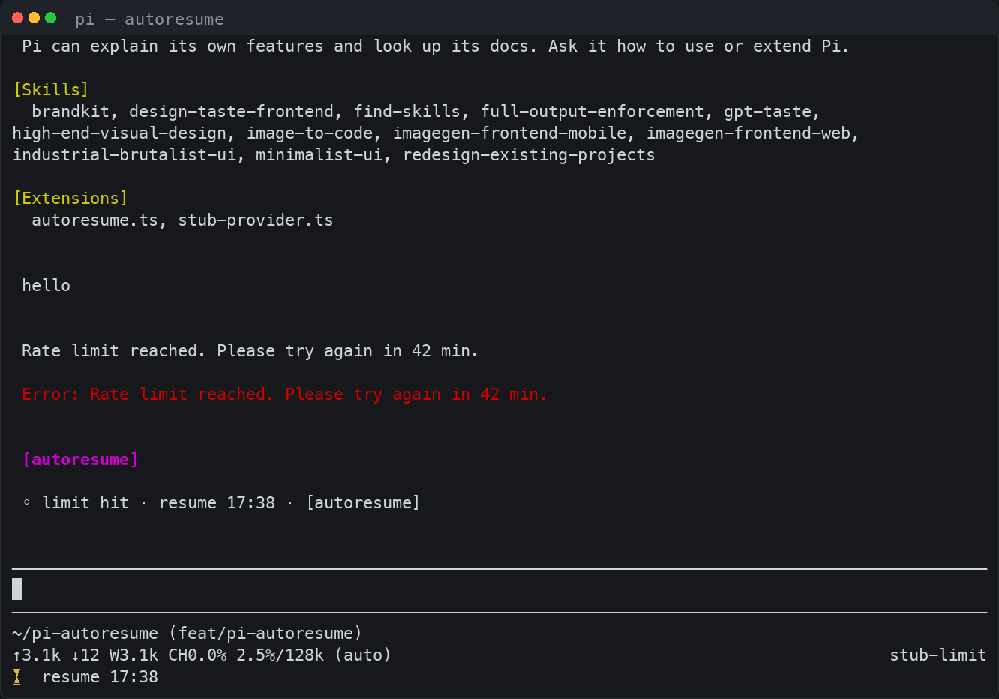
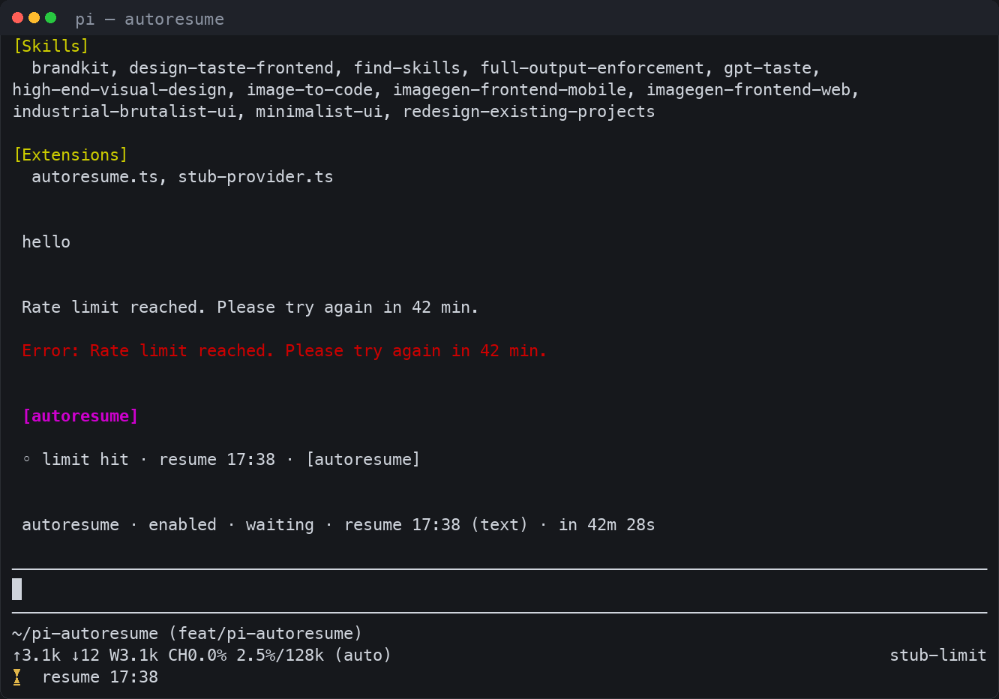

# pi-autoresume

Automatically resume a [pi](https://pi.dev) session after a provider usage or rate-limit stop.

## What it does

When a provider stops a turn because of a usage or rate limit, pi-autoresume waits for the limit to reset — or applies progressive backoff when the provider does not communicate a reset time — and then continues the session automatically. It acts only after pi's native retries have settled, ignores failures that waiting cannot fix (invalid API keys, auth, billing, insufficient quota), and keeps all state in memory: nothing is persisted across restarts.



## Install

```bash
# from npm
pi install npm:@cthulberg/pi-autoresume

# from this git repository
pi install git:github.com/cthulberg/pi-autoresume

# from a local checkout directory
pi install ./pi-autoresume

# try it for one invocation from a local checkout
pi -e ./extensions/autoresume.ts
```

## Usage

### Commands

| Command | Effect |
|---|---|
| `/autoresume` or `/autoresume status` | Report state: enabled/disabled, and while waiting the reset source, reset time, and time remaining |
| `/autoresume cancel` | Cancel the pending wait; autoresume stays enabled |
| `/autoresume off` | Cancel the pending wait and disable autoresume for this session (memory only) |
| `/autoresume on` | Re-enable autoresume for this session (does not override `enabled: false` in settings) |
| `/autoresume <other>` | Print usage |

Status examples:

```text
autoresume · enabled · idle
autoresume · enabled · waiting · openai-codex · resume 17:38 (text) · in 42m 28s
autoresume · enabled · waiting · openai-codex · backoff 2/5 · retry in 15m
autoresume · disabled (session) · idle   # after /autoresume off
autoresume · disabled (settings) · idle  # when the setting enabled is false
```



While a wait is pending the footer shows a countdown, refreshed every minute:

- reset-based wait: `⏳ resume 17:38`
- backoff wait: `⏳ retry in 15m · 2/5`

### Settings

Autoresume reads an `autoresume` key from pi's settings (`~/.pi/agent/settings.json`, or `.pi/settings.json` for a single project). The block below shows the defaults; copy the keys you want to change.

```json
{
  "autoresume": {
    "enabled": true,
    "templates": {
      "waiting": "◦ limit hit · resume {reset_abs} · [autoresume]",
      "waiting_backoff": "◦ limit hit · retry in {retry_in} · [autoresume {attempt}/{max}]",
      "resuming": "▶ resuming after limit reset",
      "exhausted": "■ autoresume stopped · {max} attempts exhausted"
    }
  }
}
```

Set `enabled` to `false` to disable autoresume everywhere. Templates are rendered with the placeholders below; unknown placeholders are left verbatim.

| Placeholder | Value |
|---|---|
| `{provider}` | Provider id of the failed assistant message (`unknown` when unavailable) |
| `{model}` | Model id of the failed assistant message (`unknown` when unavailable) |
| `{when}` | Local `HH:MM` when the wait was armed (empty in `exhausted`) |
| `{reset_abs}` | Local `HH:MM` reset time for reset-based waits (empty otherwise) |
| `{reset_rel}` | Time until reset, prefixed with `~` (for example `~42m 30s`); reset-based waits only |
| `{retry_in}` | Time until the next attempt (`42m 30s` for a reset wait, `15m` for a backoff wait; empty in `exhausted`) |
| `{attempt}` | Consecutive backoff attempt `1`–`5` (`0` for reset-based waits; empty in `exhausted`) |
| `{max}` | Maximum consecutive backoff attempts: `5` |
| `{reason}` | How the reset was found: `header` or `text` (`backoff` for backoff waits; empty in `exhausted`) |

The four messages are sent as custom messages in the transcript; `resuming` is the one that continues the session.

## How it works

- Autoresume acts only on `agent_settled`, after pi's native retries have fully settled, and only when the last assistant message ended with `stopReason: "error"`.
- Hard stops that waiting cannot fix (invalid API keys, auth, billing, insufficient quota) are ignored before anything else.
- Limit classification is ordered; first match wins:
  1. `retry-after-ms` / `retry-after` response headers (trusted only for HTTP 429 or limit-like error text)
  2. the `Server requested Ns retry delay` message from pi
  3. Codex-style `Try again in ~N min`, plus a 30-second safety buffer
  4. generic reset text such as `in 2m30s`, `in 90 seconds`, `try again at 3:00 pm`, or `resets at 09:30`
  5. limit-like wording without a usable reset time → progressive backoff
- Backoff waits are 5m, 15m, 30m, 1h, 2h, with at most 5 consecutive attempts. Reset-based waits do not consume attempts, and a settled run that is not a limit error resets the counter.
- Long waits are re-evaluated in chunks: each timer sleeps between 30 seconds and 60 minutes, and reset times beyond 7 days are not honored (those fall back to backoff).

## Limits

- **In-session only.** The pending wait lives in memory. Quitting pi or reloading extensions cancels it; nothing is persisted.
- **No escape key.** Control is the `/autoresume` command: `cancel` disarms the wait, `off` disables autoresume for the session. Sending a message while waiting also cancels the pending wait; the next limit stop arms again.
- **Provider coverage.** The `openai-codex` subscription-limit message (`Try again in ~N min`) is covered by the test suite, as are the `retry-after`/`retry-after-ms` header and generic reset-text paths; any provider that reports a reset through those paths works through the same provider-agnostic logic. Providers that communicate no reset time fall back to backoff.
- **TUI chrome.** The footer countdown and notifications are shown in the interactive TUI; classification and continuation also work in non-interactive modes.

## Development

```bash
bun install
bun run test               # unit tests (classify, schedule, format)
bun run test:integration   # RPC integration tests; spawns `pi`, takes about 40 s
bunx tsc --noEmit          # typecheck
```

The integration tests spawn the `pi` binary from your `PATH` and take about 40 seconds because the minimum wait is 30 seconds by design.
